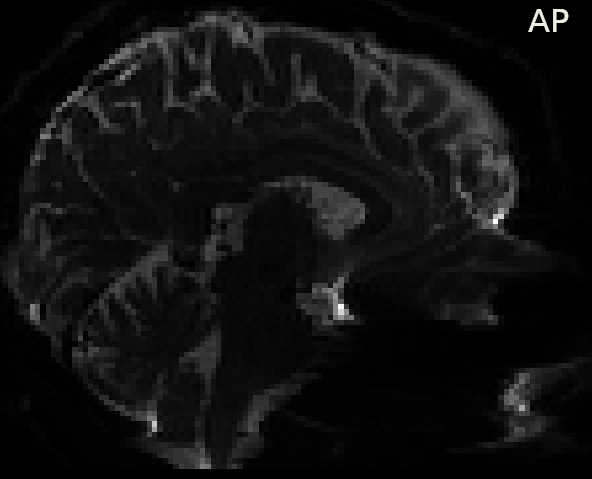
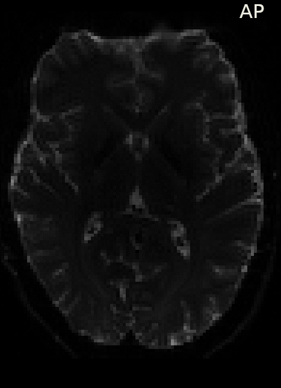

# _DWIPrep_: A Robust Preprocessing Pipeline for dMRI Data

This pipeline is being developed and maintaing [Yaniv Assaf's lab at Tel Aviv University](https://www.yalab.sites.tau.ac.il/), as an open-source tool for preprocessing of dMRI data.

_DWIPrep_ is a diffusion magnetic resonance image (dMRI) data preprocessing pipeline that is designed to provide and easily accessible, robust and dynamic interface, allowing basic preprocessing for both within-subject (plasticity) and between-subjects datasets, envolving a wide variety of dMRI scan acquisitions.  
The _dMRIPrep_ pipeline uses a combination of tools from well-known software packages, including [FSL](https://fsl.fmrib.ox.ac.uk/fsl/fslwiki/), [MRtrix3](https://mrtrix.readthedocs.io/en/latest/), [SPM](https://www.fil.ion.ucl.ac.uk/spm/) and [CAT12](http://www.neuro.uni-jena.de/cat/). This pipeline was designed to provide a potentially best preprocessing pipeline for a wide range of dMRI data acquisition parameters, and will be updated as new neuroimaging software become available.

This tool allows you to easily do the following:

- Preprocess a wide variety of dMRI data, from raw to fully preprocessed form.
- Account for specific preprocessing procedures that are crucial of analyzing plasticity (i.e, within-subjects) datasets.
- Automate processing steps.

____
# Preprocessing pipelines (including demonstrations):
## Longitudinal (multi-sessions):
1. Extract opposite phase-encoding DWI's B0 volumes for later Susceptability Distortions Correction (SDC)

2. Susceptability Distortions Correction (SDC) using FSL's [*topup*](https://fsl.fmrib.ox.ac.uk/fsl/fslwiki/topup)1 and [*Eddy*](https://fsl.fmrib.ox.ac.uk/fsl/fslwiki/eddy)2, as implemented via MRTrix3's [*dwifslpreproc*](https://mrtrix.readthedocs.io/en/latest/reference/commands/dwifslpreproc.html)3. Note that the pipeline assumes **opposite** phase encoding directions, as it was found to be optimal for SDC4

    

    *Figure 1:* AP and PA represent the opposite, uncorrected, B0 volumes - extracted from opposite phase-encoded DWIs, "corrected" stands for post-SDC implementation of *dwifslpreproc*.
3. B1 field inhomogeneity correction for a DWI volume series, using the N4 algorithm as provided in ANTs ([*N4BiasFieldCorrection*](https://simpleitk.readthedocs.io/en/master/link_N4BiasFieldCorrection_docs.html))5, as implemented in MRTtrix3's [*dwibiascorrect*](https://mrtrix.readthedocs.io/en/latest/reference/commands/dwibiascorrect.html#dwibiascorrect-ants)3

___
## References
1. Andersson, J. L., Skare, S., & Ashburner, J. (2003). How to correct susceptibility distortions in spin-echo echo-planar images: application to diffusion tensor imaging. Neuroimage, 20(2), 870-888.
2. Andersson, J. L., & Sotiropoulos, S. N. (2016). An integrated approach to correction for off-resonance effects and subject movement in diffusion MR imaging. Neuroimage, 125, 1063-1078.
3. Tournier, J. D., Smith, R., Raffelt, D., Tabbara, R., Dhollander, T., Pietsch, M., ... & Connelly, A. (2019). MRtrix3: A fast, flexible and open software framework for medical image processing and visualisation. NeuroImage, 202, 116137.
4. Gu, X., & Eklund, A. (2019). Evaluation of six phase encoding based susceptibility distortion correction methods for diffusion MRI. Frontiers in neuroinformatics, 13, 76.
5. Tustison, N. J., Avants, B. B., Cook, P. A., Zheng, Y., Egan, A., Yushkevich, P. A., & Gee, J. C. (2010). N4ITK: improved N3 bias correction. IEEE transactions on medical imaging, 29(6), 1310-1320.
